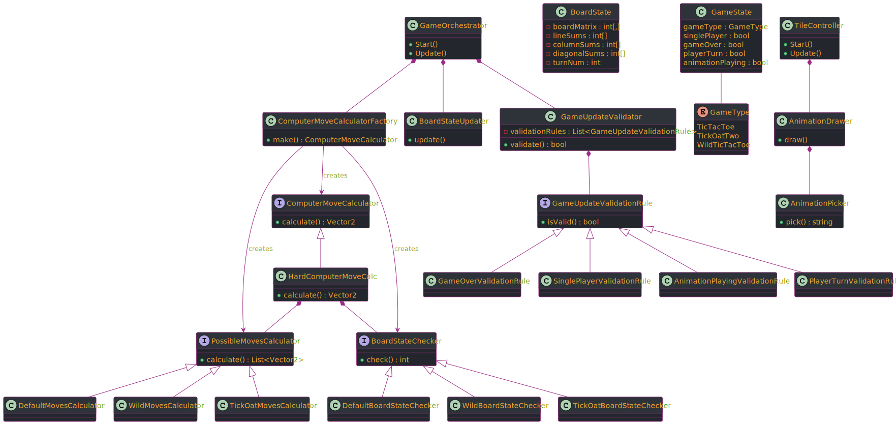

# 3-Tac-Toe

**[Play the game here](https://vmrfreitas.itch.io/3-tac-toe)**
Welcome to the source-code of my first game-dev learning project. I wanted to start my learning journey by making a very simple first game that would also help me learn a bit of AI (the classic AI, not gen-AI lol), that is why I chose tic-tac-toe. But I want to add a twist to every project, that is why I developed 3 versions of tic-tac-toe.\
As life went on I eventually became a trainer for the SOLID design principles on my job as Software Engineer, that's when I decided to re-design and later re-factor my 3-tac-toe code.\
In this readme I'll explain [how to play](#how-to-play) each version and later show you the initial [class diagram](#class-diagram) I made and explain it in more detail.

## How to play

On the game menu you can choose which tic-tac-toe variation you'd like to play. And by clicking the **?** button you can see an explanation text for the game.\
After you select the variation you can choose to play alone (against the computer) or take turns playing with a friend.

### Tic-tac-toe
This is classic [tic-tac-toe](https://en.wikipedia.org/wiki/Tic-tac-toe), you start, you are the **X**. \
There's a three-by-three grid of empty spaces that you can click. Clicking a space will draw an **X** and then the opponent's turn will begin. The opponent will draw an **O** on another empty space and it will be your turn again.\
The objective is to draw 3 equal symbols on a line or diagonal. The first one to achieve this will win.\
After the game ends you can click on the X on the top left corner to go back to the main menu and play again.

### TicOatTwo
A tic-tac-toe variant created by the youtuber Oats Jenkins. He explains his creation on [this video](https://www.youtube.com/watch?v=ePxrVU4M9uA) and you can play the original on the [tickoattwo.com](https://www.tickoattwo.com/) website.\
\
Here you also have a three-by-three grid of empty spaces that you can click. Clicking a space will draw a vertical line **|** and then the opponent's turn will begin. The opponent will draw a horizontal line **-** on another space and your turn will resume.\
On this mode you can draw your line on top of the opponent's **-** line, **but not on the last line that they played, while the opponent cannot draw on the last line that you played**. This unplayable line will be colored green, you cannot click on top of it.\
The objective of this game is to draw 3 **+** (a vertical line on top of a horizontal line) on a line or on a diagonal, the first one to achieve this will win.

### Wild tic-tac-toe
On this variant you can choose **on every move** if you want to draw an **X** or an **O**.\
On the bottom right corner there are 2 checkboxes, the checkbox that is filled will be the symbol you chose to play.\
There's also a three-by-three grid of empty spaces that you can click. Clicking a space will draw your chosen symbol and then the opponent's turn will begin. The opponent will also choose a symbol and draw it on another empty space and it will be your turn again.\
The objective is to draw 3 equal symbols on a line or diagonal. The first one to achieve this will win. You can win using either **X** or **O**.

## Class diagram

After completing the logic for tic-tac-toe, all of the code was on a god-class. Just thinking about including the two other versions gave me the chills. The design is the result of extracting everything from this god-class and **separating what changes**. This design doesn't reflect exaclty how the code looks now but the idea remained the same and the differences are part of the learning journey. Below I'll go class by class and explain it in more detail.

### BoardState and GameState

These are static classes containing the game general context. These variables are used throughout the code to create the dependencies in the factories, as part of the validation rules, to interrupt the game execution, etc. The `GameState` class is pretty self-explanatory so I'll just explain the `BoardState`one:

#### BoardState

* `boardMatrix` contains the game but in numbers. If the player clicks the top-left corner, that will translate to `boardMatrix = 1`, for example.
* `lineSums`, `columnSums` and `diagonalSums` will have the value of every space in a line, column and diagonal summed up. These are used by the `BoardStateChecker` class to see if the game ended, basically. Very important on the computer move calculation.
* `turnNum` will contain which turn number it is. This is important on the move calculation to see if there's a tie, or if it's too early to check if the game ended.

### GameOrchestrator

With the spirit of [favoring composition over inheritance](https://en.wikipedia.org/wiki/Composition_over_inheritance), I created this class to be composed of the others and call their methods in the desired order. The `Start` and `Update` methods are default Unity methods, they are called when the Scene loads and every frame, respectively.\
The idea was to have a `GameOrchestratorAssembler` class that would be responsible for instantiating and injecting the dependencies into the orchestrator class, but Unity didn't like the idea of assembling a `MonoBehaviour` class before loading the Scene (or at least I didn't try enough). Consequently the `Start` method was used for this purpose. It reads the `GameType` from the `GameState` and instantiates the according classes, for instance.

### PossibleMovesCalculator and BoardStateChecker

The main thing that changes from game type to game type is how the computer decides its move. The `min` and `max` functions from the [minimax algorithm](https://en.wikipedia.org/wiki/Minimax) will calculate their values differently.\
By making the code once and analysing it I decided that the two main things that change are: the possible moves available for the computer to make and how to decide if the game is over. So these two interfaces have one different implementation for each game type. Since I never use a state checker from a game type with a possible moves calculator from a different game type, the class responsible for creating this dependency is the `ComputerMoveCalculatorFactory`.

### ComputerMoveCalculator and its factory

I made the `ComputerMoveCalculator` an interface because I wanted to make three classes for three difficulties, but in the end the only one that actually got made was the hard one, this means that it is impossible to win against the computer, sorry lol.\
The factory receives the `GameType`, instantiates the `PossibleMovesCalculator` and the `BoardStateChecker`, and returns the instance of the built calculator.

### GameUpdateValidator and its children

These rules are to decide if the `Update` method from the `GameOrchestrator` is allowed to run. It can only run if the game is not over, if single player is selected, if there's no animation playing and if it isn't the player's turn.\
The validator is a pretty abstraction for a big `if`, basically. Instead of checking all these 4 conditions, which are reflected on the validation rules classes, on a big if statement, it loops through all the rules and returns a true or false. With the validator I could add more conditions easily on the future.

### TileController, AnimationDrawer and AnimationPicker

This class is tied to the "tile" game object, which is the clickable space on the game. This controller will receive the player input and update the `BoardState` with it.\
Another responsability of this class is drawing on the tile. It calls the `AnimationDrawer` which draws whatever the `AnimationPicker` decides. The decision is made on the value of the tile and the `GameType`.